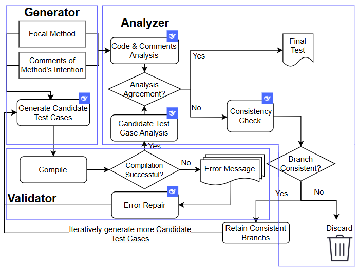

# **DISTINCT: Description-Guided Non-regressive Test Case Generation**

## **1\. Introduction**

Unit testing is a cornerstone of software quality assurance. However, existing unit test generation methods predominantly focus on regression scenarios and often fall short in non - regression settings where the method under test may be faulty. To address this limitation, we propose ****DISTINCT****, a novel framework that incorporates natural - language descriptions (NLDs) of methods' intended behavior into the test case generation process. The workflow is shown below.




## **2\. Datasets**

### **2.1 Defects4J - Desc and QuixBugs - Desc**

We extended the Defects4J and QuixBugs datasets to create two new datasets, ****Defects4J - Desc**** and ****QuixBugs - Desc****. Each dataset pairs every buggy method with its NLD, providing critical semantic context for test generation.

### **2.2 Dataset Structure**

The QuixBugs - Desc.json file in the DISTINCT/Datasets directory contains information about the QuixBugs - Desc dataset. It includes details such as the class name, project path, class declaration, method body, and test method information for each buggy method.


## **3\. Open - Source Code**

### **3.1 Candidate Test Case Generator**

The DISTINCT/ExperimentCode/Candidate Test Case Generator directory contains scripts for generating initial test cases.

- ****Initial_test_qianfan.py****: This script uses the Baidu Qianfan model to generate initial test cases based on the provided NLDs and buggy methods.


### **3.2 Validator & Analyzer**

The DISTINCT/ExperimentCode/Validator & Analyzer directory contains scripts for analyzing test results and attempting to repair compilation or test failures.

- ****Test_Iterator_qianfan.py****: Uses the Qianfan model to analyze test results and repair errors.
- ****Test_Iterator_deepseek.py****: Uses the DeepSeek model to analyze test results and repair errors.


### **3.3 Coverage Calculation**

The DISTINCT/ExperimentCode/CoverageCal directory contains scripts for calculating code coverage.

- ****calc_coverage.py****: Reads the result.json file, processes projects with Test == 1, calculates coverage, and saves the results.

## **4\. Environmental Requirements**

### **4.1 Prerequisites**

- Python 3.8
- Required Python libraries: openai, qianfan, chardet, json, os, re


## **5\. Getting Started**

### **5.1 Clone the repository**

```bash
git clone &lt;repository_url&gt;cd DISTINCT
```

### **5.2 Data Preparation**

Ensure that the Defects4J - Desc and QuixBugs - Desc datasets are available and the file paths in the scripts are correctly configured.

### **5.3 Running Experiments**

#### **5.3.1 Generate Initial Test Cases**

```bash
python DISTINCT/ExperimentCode/Candidate Test Case Generator/Defects4J - Desc/Initial_test_qianfan.py
```
#### **5.3.2 Analyze and Repair Test Results**

```bash
python DISTINCT/ExperimentCode/Validator & Analyzer/Defects4J - Desc/Test_Iterator_deepseek.py
```
#### **5.3.3 Calculate Coverage**

```bash
python DISTINCT/ExperimentCode/CoverageCal/Defects4J - Desc/calc_coverage.py
```
## **6\. Configuration**

- ****API Keys****: Replace "Your api_key" in relevant files with your actual API keys.
- ****File Paths****: Update the file paths in the scripts according to your local environment, such as json_path, output_base, etc.

## **7\. Contribution**

Contributions to this project are welcome. Please follow these steps:

1.  Lead the first in-depth study of unit-test generation in the non-regression setting, where the focal method may be faulty.
2.  Construct two enriched datasets—Defects4J-Desc and QuixBugs-Desc—annotated with comments and paired buggy/repaired methods.
3.  Propose Distinct, a novel framework that integrates LLM-based generation with semantic refinement via branch-consistency analysis.
4.  Extensive experimental results demonstrate that DISTINCT substantially outperforms state-of-the-art tools in both defect detection and test coverage.
